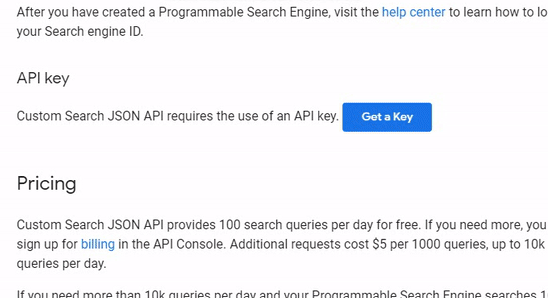

<h1 align="center"> END OF SERVICE 😢</center>
<h1><a href="https://www.zippyshare.com/">Zippyshare</a> has ended its service in March 2023, so this code no longer work again</h1>

---
<h1 align="center"> ZippyDamn!</h1>

<h2 align="center">
ZippyDamn! is a ZippyShare Unofficial CLI (downloader & search) for nodejs</h2>

<div align="center">
    
    
    
</div>

<div align="center">


</div>

## Installation

Use the package manager npm to install _ZippyDamn!_ CLI

```bash
npm install zippydamn -g
```

## Usage

```bash
Usage: zippydamn [global options] command

Options:
  -s, --search <query...>     search file on zippyshare.com
  -d, --download <link>       extract url and give you downloadable link
  -dl, --downloadFile <link>  extract url, download and save file to local (path is optional)
  -h, --help                  display help for command

Example command:
  $ zippydamn -s song
  $ zippydamn -d https://www19.zippyshare.com/v/lKeHaNxX/file.html
  $ zippydamn -dl https://www19.zippyshare.com/v/lKeHaNxX/file.html
  $ zippydamn -dl https://www19.zippyshare.com/v/lKeHaNxX/file.html C:\Users\Windows\Music

```

| Feature             | Status |
|---------------------|--------|
| Extract Link         |  OK    |
| Multiple Extract Link|  DISABLED    |
| Search File          |  OK    |
| Download File       | OK (Beta) |
| Multiple Download File | PROGRESS |

# Upcoming Feature
Zippydamn! Website

please open-source do your magic :)

---
## UPDATE V0.0.8 !
### Added optional path to save files
```bash
zippydamn -dl https://www19.zippyshare.com/v/lKeHaNxX/file.html C:\Users\Windows\Music
```

_File will be saved in C:\Users\Windows\Music_

## UPDATE V0.0.7 !
### Multi download feature is disabled
*for next update, this feature will be exist again :)*

### Now you can download & save to local disk without providing CSE API Key
*but you still using CSE API Key for searching :D*

### Change callback code to async await :D
Callback is suck you know? >:), so i decided move to async await! :D

---
## UPDATE V0.0.6 !
### ZippyDamn search need a Google CSE API Key to run
1. Open [https://developers.google.com/custom-search/v1/overview](https://developers.google.com/custom-search/v1/overview)
2. Click "Get a Key"
3. Write your project name
4. Replace "YOUR_API_KEY" with your Google Key in .env file
  ```GOOGLE_CSE_KEY = "YOUR_API_KEY"```



### Added a Download feature (beta)
So you can download and save your zippyshare file to local disk

*with tiny progress bar :) ~*

## Contributing <3
Pull requests are welcome. For major changes, please open an issue first to discuss what you would like to change.
Please make sure to update tests as appropriate.

## License
[MIT](https://choosealicense.com/licenses/mit/)

---

Made with <3 by Virdio
