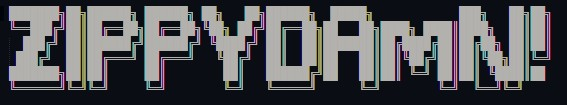

# ZippyDamn!

_ZippyDamn!_ is a ZippyShare Unofficial CLI (downloader & search) for nodejs

## Installation

Use the package manager npm to install _ZippyDamn!_ CLI

```bash
npm install zippydamn -g
```

## Usage

```bash
Usage: zippydamn [global options] command

Options:
  -s, --search <query...>  search file on zippyshare
  -d, --download <link>    download just one link
  -m, --multi <source...>  download multiple link from files
  -h, --help               display help for command

Example command:
  $ zippydamn -s song
  $ zippydamn -d https://www19.zippyshare.com/v/lKeHaNxX/file.html
  $ zippydamn -m file.txt result.txt
```

| Feature | Status |
|---------|--------|
|Download |   OK   |
|Multiple Download|OK|
|Search File|  OK |


## Contributing
Pull requests are welcome. For major changes, please open an issue first to discuss what you would like to change.

Please make sure to update tests as appropriate.

## License
[MIT](https://choosealicense.com/licenses/mit/)